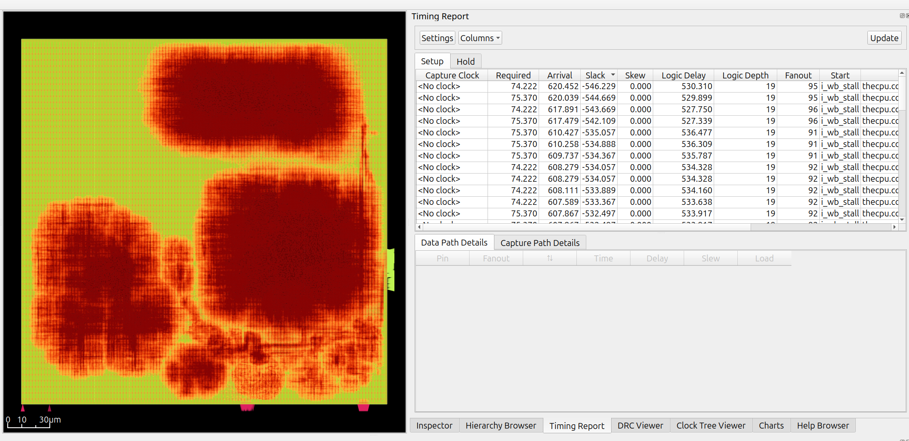

OpenROAD ASAP7 PDK configuration
================================

TL;DR Install Bazelisk and run command below to build and view design in the GUI, Bazelisk handles all dependencies.

Demonstrates how to set up an [bazel-orfs](https://github.com/The-OpenROAD-Project/bazel-orfs) to build the design with [OpenROAD-flow-scripts](https://github.com/The-OpenROAD-Project/OpenROAD-flow-scripts)

To build and view [Install Bazelisk](https://bazel.build/install/bazelisk) and run:

    bazel run //openroad:zipsystem_cts /tmp/cts gui_cts

Estimated routing congestion
----------------------------

Ideas for future work
=====================

- Synthesis takes a few minutes, this is because of the SRAMs. Move the SRAMs
  used into separate modules and instantiate them as macros. This will be more
  idiomatic for a tape-out, though the SRAMs in the example are somewhat on the
  small side 9216 bits and could reasonably be instantiated as flip flops in
  a flattened design as is the case here. The author has heard 1024 bits thrown
  around as being about the right time to switch from flip flops to SRAMs,
  unless read/write ports are dominating area, such as for a register file.
- Flesh out constraints.sdc with all the correct clocks and any false paths for
  asynchronous reset, input/output delay, etc.
- add IO constraints to place pins on one edge of the SRAMs and top level
- reduce area

[MegaBoom](https://github.com/The-OpenROAD-Project/megaboom) demonstrates a number of techniques to study a design and set up mock SRAMs.
